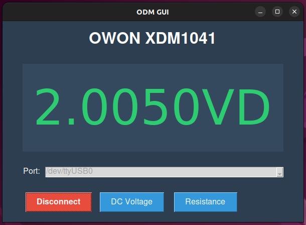

# OWON-XDM1041 Python utility 
### Also supports a simple desktop gui</br>



## Usage </br>
First install the requirements
```shell
pip install -r reqirements.txt
```

To run the gui
```shell
python3 gui.py
```
